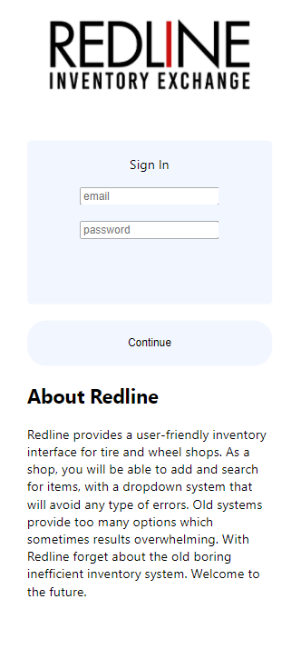
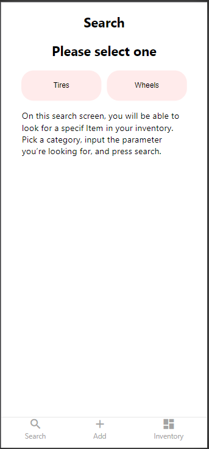
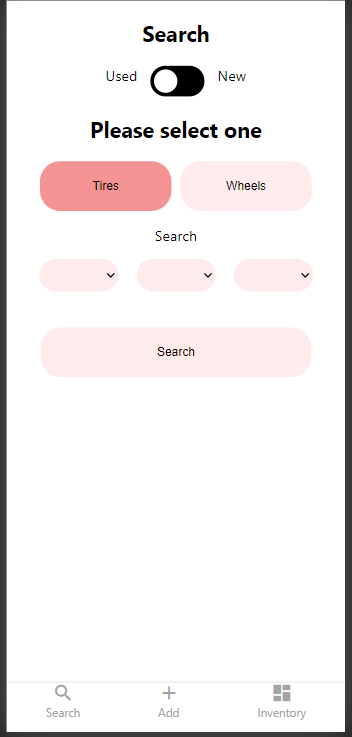
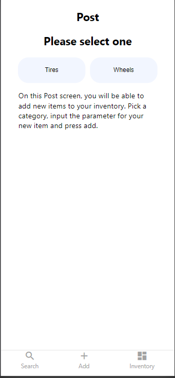
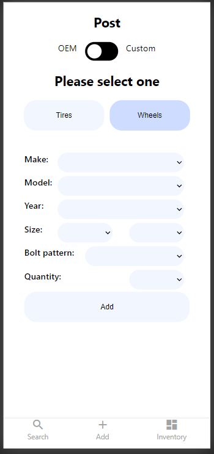
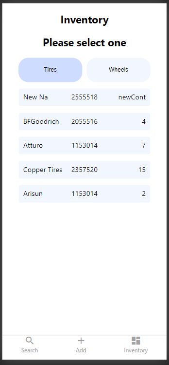

This app will allow tire & wheel shop owners a more efficient way to keep up with what they have in stock.
A very modern and user-friendly interface with a powerful and organized storage system. I created this app
because as someone who has worked in this industry I notice a great need for modernization and better organization of their inventory system. I created this app thinking about how to make a simple and useful way to keep up.

Link to live demo : https://redline.vercel.app/

API: 'https://mighty-oasis-55773.herokuapp.com'

SnapShots: 

 

